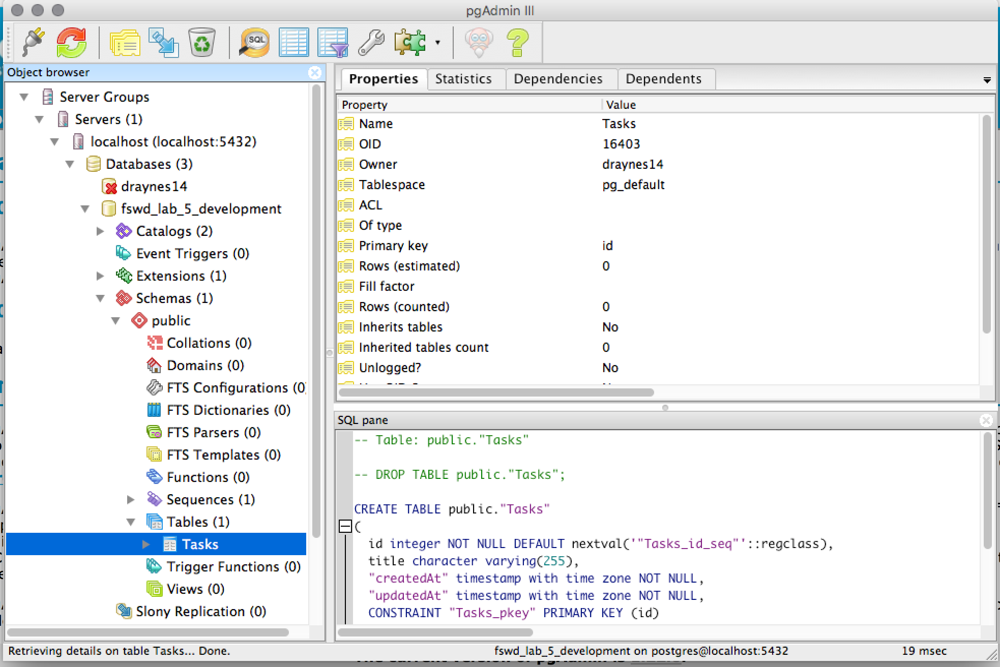

# Full Stack Web Development - Lab 5: All Your (Data)Base Are Belong To Us

1. Fork the repository to your own Github account.
2. Clone your fork to your own machine.
3. Navigate to the clone on your machine and run `npm install`
4. Then run `npm run dev_db_create`

## Let's look at the database!

You installed postgres, right? (`brew cask install postgres` and `brew
install postgresql`)

Now install [pgAdmin](http://pgadmin.org) by running `brew cask
install pgadmin3`. Then open it with `open
~/Applications/pgAdmin3.app`. In the `File` menu, select `Add
Server...`. Enter `localhost` for the name and host and click 'OK'.

## Links

* [Sequelize DataTypes](http://docs.sequelizejs.com/en/latest/docs/models-definition/#data-types)
* [Sequelize Validations](http://docs.sequelizejs.com/en/latest/docs/models-definition/#validations)
* [Sequelize Hooks](http://docs.sequelizejs.com/en/latest/api/hooks/)
* [Sequelize Model methods](http://docs.sequelizejs.com/en/latest/docs/models-usage/)
* [Sequelize Querying](http://docs.sequelizejs.com/en/latest/docs/querying/)

